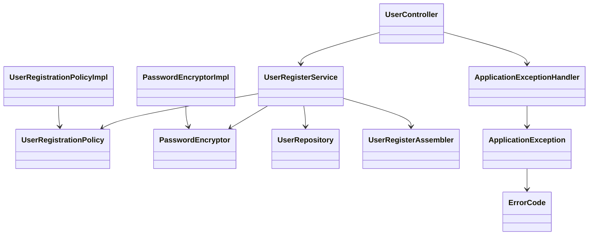
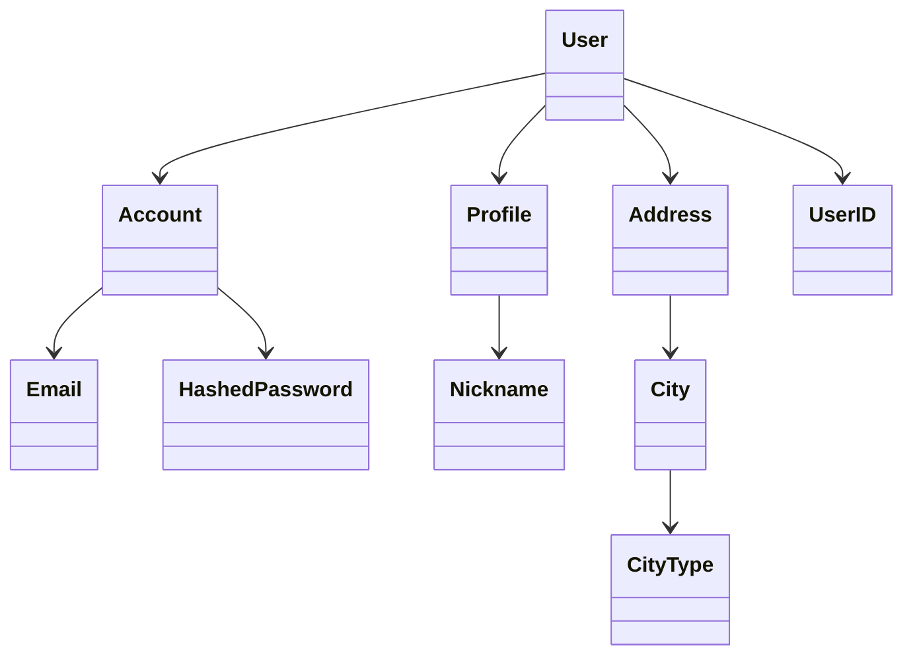
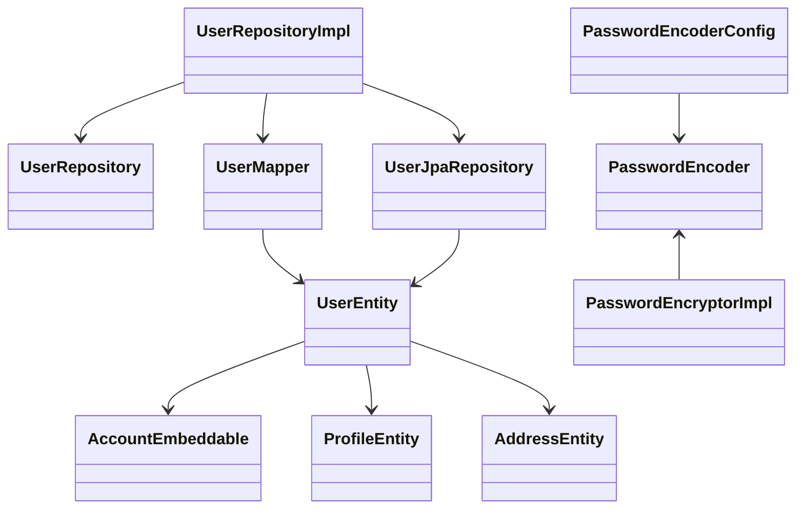
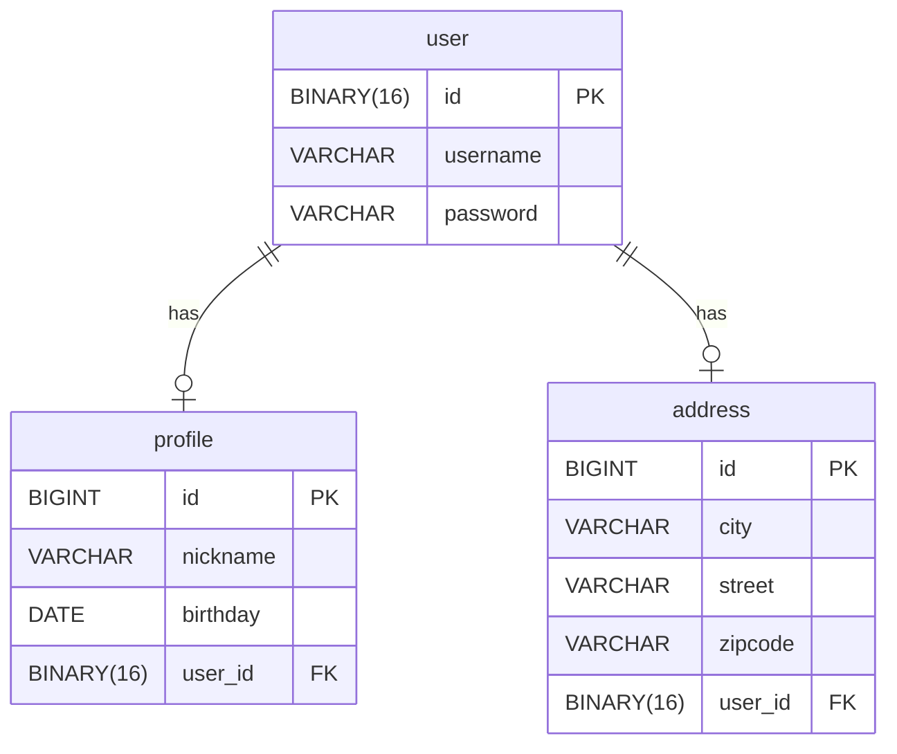
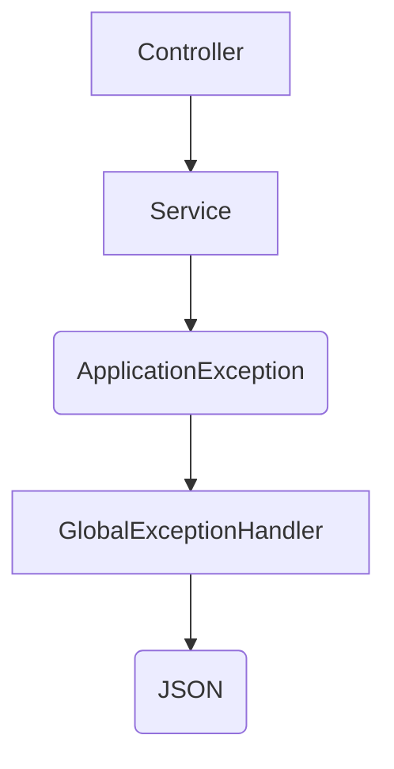

# 📌 Domain Structure Application

이 프로젝트는 DDD(Domain Driven Design) 설계 원칙과 Spring Boot, JPA를 기반으로 User 도메인을 구현한 예제입니다.

---

## 🌱 기능 개요

- **회원 등록** (이메일 중복검사, 비밀번호 조건 검사 포함)
- 명시적 Value Object (VO) 관리
- DDD 기반 레이어드 아키텍처
- 예외 처리 중앙 관리 (Controller Advice)

---

## 📂 프로젝트 구조

```bash
src/main/java
└── domainstructure
    └── domainstructure
        ├── application
        │   ├── exception         # 예외 처리 및 Error Code 관리
        │   └── user              # 회원가입 관련 컨트롤러, DTO, 서비스, 정책 구현체
        ├── core
        │   ├── common            # 범용 VO (Email 등)
        │   └── user              # 도메인 모델, VO, 서비스 인터페이스
        └── infrastructure
            ├── common            # JPA Converter 등 공통 인프라
            ├── security          # 패스워드 암호화
            └── user              # 엔티티, JPA 레포지토리, 매퍼
```

---

## 🎨 계층 구조 및 흐름

```text
[Controller] → [Application Service] → [Domain Policy & Service Interface]
                                  │
                                  ↓
                    [Domain Repository Interface] ← [Infrastructure]
```

---

# 📌 계층별 클래스 다이어그램

아키텍처가 **DDD의 레이어드 아키텍처 원칙**을 따르고 있어, 각 레이어가 명확히 분리되어 있습니다.  
이는 **확장과 유지보수에 유리한 구조**로, 향후 신규 요구사항을 쉽게 대응할 수 있습니다.

다음은 각 계층별로 나눈 클래스 다이어그램입니다.

---

## Application 레이어

**애플리케이션 레이어는 유스케이스 흐름과 정책 검증을 담당합니다.**



> - 새로운 유스케이스나 정책이 추가될 때 Application 레이어에서 손쉽게 확장 가능합니다.
> - 정책(`UserRegistrationPolicy`) 및 암호화 전략(`PasswordEncryptor`)은 인터페이스 기반이므로, 다양한 구현체로 확장 가능합니다.

---

## Core (Domain) 레이어

**핵심 도메인 객체, VO(Value Object), 도메인 서비스 인터페이스를 정의합니다.**



> - 도메인 모델과 VO가 명확히 정의되어 있어 도메인의 규칙 변경에 유연하게 대응할 수 있습니다.
> - VO 단위의 명확한 검증 로직 덕분에 도메인 무결성을 쉽게 유지할 수 있습니다.

---

## Infrastructure 레이어

**기술적인 구현 (DB 접근, 엔티티 ↔ 도메인 매핑, 암호화)을 담당합니다.**



> - Infrastructure 레이어는 기술 선택에 따라 쉽게 변경 가능합니다.
> - Mapper 클래스 덕분에 엔티티 구조가 변경되어도 도메인 레이어에 영향을 최소화할 수 있습니다.

---

## 🚀 확장 가능한 설계

| 확장 포인트                 | 설명                                                      |
|------------------------|---------------------------------------------------------|
| **정책 인터페이스**           | 인터페이스 기반 정책 정의로, 다양한 정책을 손쉽게 추가 및 교체 가능                 |
| **VO 중심 설계**           | VO 단위로 명확히 검증 로직 관리 가능. 도메인 무결성 유지에 효과적                 |
| **Infrastructure 추상화** | Repository와 암호화 모듈은 인터페이스 기반으로 추상화되어, 인프라 기술 변경이 쉽고 독립적 |

---

## 💾 ER 다이어그램



---

## 🚀 주요 클래스 및 역할

### Application

| 클래스명                         | 역할                    |
|------------------------------|-----------------------|
| `UserController`             | API 요청을 받고 응답 반환      |
| `UserRegisterService`        | 사용자 등록 유스케이스 수행       |
| `UserRegistrationPolicyImpl` | 이메일 중복 검사, 비밀번호 조건 검사 |
| `UserRegisterAssembler`      | DTO → 도메인 객체 변환       |

### Core

| 클래스명                     | 역할                          |
|--------------------------|-----------------------------|
| `User`                   | 사용자 도메인 객체 (Aggregate Root) |
| `Profile`                | 사용자 프로필 정보                  |
| `Address`                | 사용자 주소 정보                   |
| `Account`                | 사용자 계정 정보(이메일, 비밀번호)        |
| `UserRegistrationPolicy` | 등록 가능 여부 판단 조건 선언           |
| `PasswordEncryptor`      | 비밀번호 암호화 책임 선언              |

### Infrastructure

| 클래스명                                                            | 역할              |
|-----------------------------------------------------------------|-----------------|
| `UserRepositoryImpl`                                            | User 저장소 구현체    |
| `UserJpaRepository`                                             | JPA를 이용한 DB 액세스 |
| `UserMapper`, `AddressMapper`, `ProfileMapper`, `AccountMapper` | 엔티티 ↔ 도메인 변환    |
| `UserEntity`, `ProfileEntity`, `AddressEntity`                  | JPA 엔티티 정의      |
| `PasswordEncoder`                                               | 비밀번호 암호화 인프라 구현 |

---

## 🚨 예외 처리 구조



예시 응답:

```json
{
  "message": "이미 등록된 이메일입니다.",
  "code": "USER_001",
  "details": "test@example.com"
}
```

---

## 🛠️ 기술 스택

- Java 17
- Spring Boot 3.x
- Spring Data JPA
- Lombok
- Jackson
- H2 / MySQL (가정)
- Maven or Gradle (가정)

---

## 🔖 앞으로 추가 및 개선할 사항

- 추가적인 회원 정책(닉네임 중복 등)
- 비밀번호 암호화 방식 변경 (BCrypt 권장)
- VO 개선 (Address.street, Address.zipcode)
- 이벤트 기반 비동기 처리 (회원 가입 이벤트 발송 등)

---

## 📚 참고 자료

- [도메인 주도 설계(DDD)](https://en.wikipedia.org/wiki/Domain-driven_design)
- [Spring Boot](https://spring.io/projects/spring-boot)
- [JPA](https://spring.io/projects/spring-data-jpa)

---

## 💡 개발자 참고

추가 개발 시 DDD 설계 원칙과 책임 분리를 반드시 유지해주세요.

- **도메인 로직**은 Core 계층에만 작성
- Application은 유스케이스 실행 및 흐름 제어
- Infrastructure는 기술적 요소만 구현 (DB 접근, 암호화 등)

---